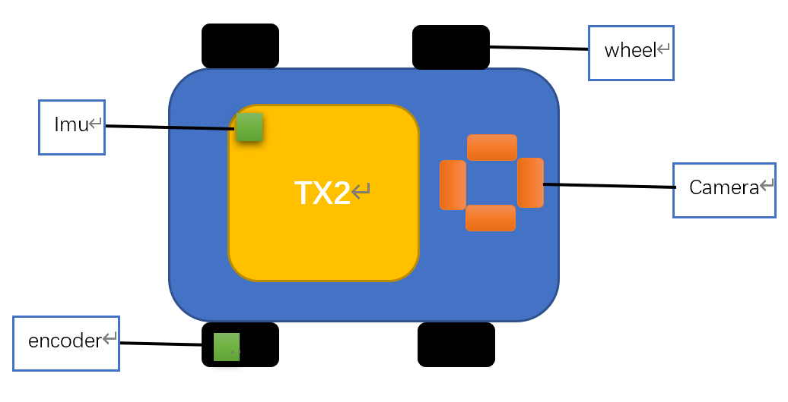
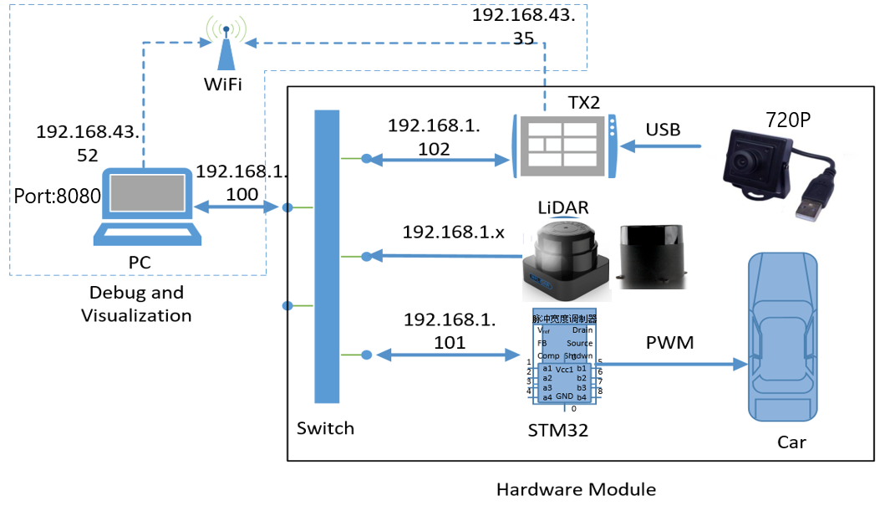
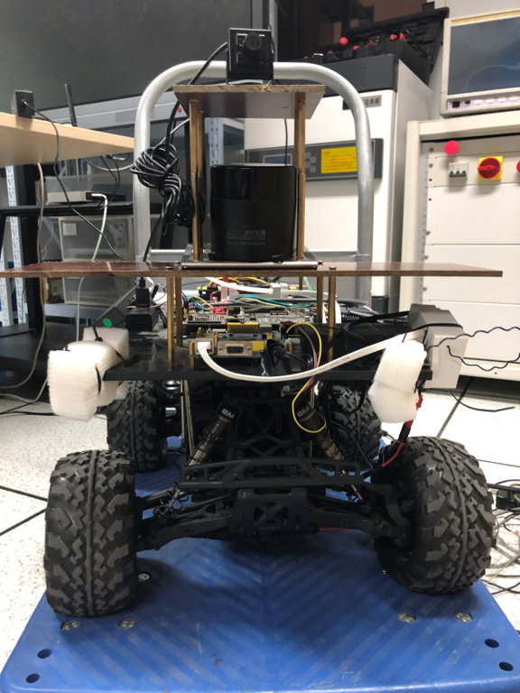
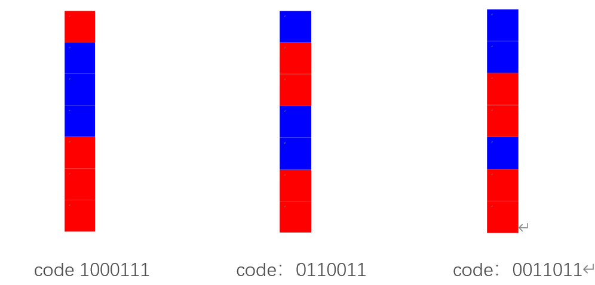
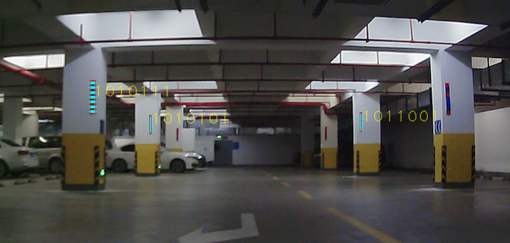
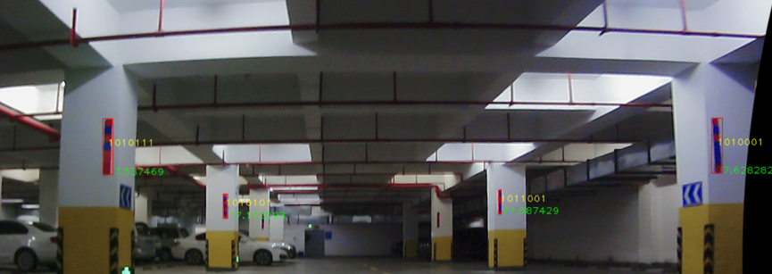
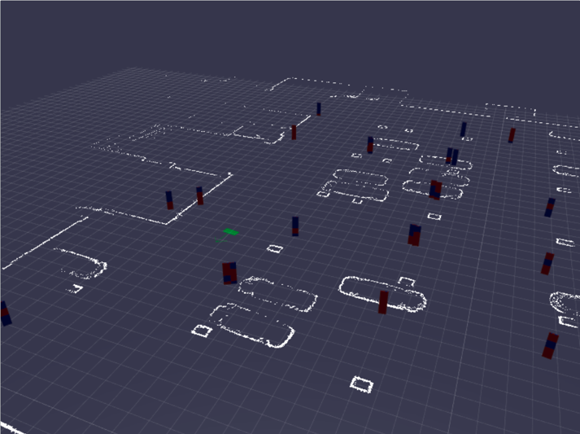
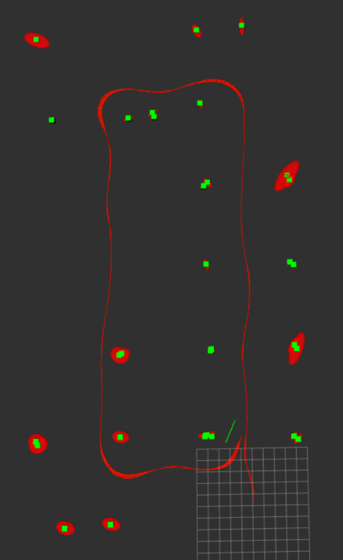

# ekf_slam
Hello, this is my project about color block and ekf slam, my English is not very good, please give me your advice.
# environment
- The experimental environment is a underground garage of zhiquan building in ZJU.  
### hardware
- We experimentalize on a mobile robot ,It has 6DOF imu,wheel encoder and mono camera.
- The Nvidia TX2 used in our experimental as the development board

### car
- The prototype of my mobile robot is a racing car brought from taobao.
- We modified it to be a motion robot inorder to experiment.

### software
- based on ROS
- Eigen,CV3

### card
- The coding of color card
  - It's made up of seven color squares
  - Red is one and blue is zero
  - A color block has seven bits of code

# details
### recognition
- First,identify the red and blue areas of the image.
- After a series of image manipulation, the color block location is found.
- According to the red and blue area, identify the coding information.Let's say red is 1 and blue is 0.
- Finally,we get the card encoder we observed.

### motion model
- state space ($x,y,\theta$ is camera pose;$m_{x,n},m_{y,n}$ is the $n$th card pose)
  - $$X=\left[\begin {matrix}x&y&\theta&m_{x,1}&m_{y,1}&\dots&m_{x,n}&m_{y,n}\end{matrix}\right]$$
- let's say that the position of the robot at time $t-1$ is $x_{t-1}=\left[\begin{matrix}x&y& \theta\end{matrix}\right]^T_{t-1}$,so at time $t$ is:
  - $$\left[\begin{matrix} x\\y\\\theta\end{matrix}\right]=\left[\begin {matrix}x\\y\\\theta\end{matrix}\right]_{t-1} +\left[\begin {matrix}\Delta s\cos(\theta+\Delta\theta)\\\Delta s\sin(\theta+\Delta\theta)\\\Delta\theta\end{matrix}\right]$$
- Covariance of robot pose at time $t$:
  - $$\Sigma_{x,t}=G_x\Sigma_{x,t-1}G_x^T+G_u'\Sigma_uG_u'^T$$
- Jacobian of robot pose at $x_{t-1}$ is:
  - $$G_x=\frac{\partial x_t}{\partial x_{t-1}}=\left[\begin{matrix}1&0&-\Delta\sin(\theta+\Delta\theta)\\0&1&\Delta\cos(\theta+\Delta\theta)\\0&0&1\end{matrix} \right] $$
- Jacobian of control variable $u=\left[\begin{matrix} \Delta s_r&\Delta s_l\end{matrix}\right]^T$
  - $$G_u=\frac{\partial x_t}{\partial u}=\left[\begin{matrix}\cos(\theta+\Delta\theta)&-\Delta\sin(\theta+\Delta\theta)\\\sin(\theta+\Delta\theta)&\Delta\cos(\theta+\Delta\theta)\\0&1\end{matrix} \right] $$ 
### map model 
- $$\left[\begin {matrix}m_x\\m_y\end{matrix}\right]=\left[\begin {matrix}\cos\theta&-\sin\theta\\\sin\theta&\cos\theta\end{matrix}\right]\left[\begin {matrix}r\cos\phi\\r\sin\phi\end{matrix}\right]+\left[\begin {matrix}x\\y\end{matrix}\right]=r\left[\begin {matrix}\cos(\theta+\phi)\\\sin(\theta+\phi)\end{matrix}\right]+\left[\begin {matrix}x\\y\end{matrix}\right]$$

### motion update
- After the color block position is added into the system, the motion equation is:
  - $$\left[\begin{matrix} x\\y\\\theta\\m_{x,1}\\m_{y,1}\\\vdots\\m_{x,N}\\m_{y,N}\end{matrix}\right]_t=\left[\begin{matrix} x\\y\\\theta\\m_{x,1}\\m_{y,1}\\\vdots\\m_{x,N}\\m_{y,N}\end{matrix}\right]_{t-1}+\left[\begin{matrix} 1&0&0\\0&1&0\\0&0&0\\0&0&0\\\vdots&\vdots&\vdots\\0&0&0\\0&0&0\end{matrix}\right]\left[\begin{matrix} \Delta s\cos(\theta+\Delta\theta)\\\Delta s\sin(\theta+\Delta\theta)\\\Delta\theta \end{matrix}\right]$$
- Update of covariance:
  - $$\bar{\Sigma_t}=G_t\Sigma_{t-1}G_t^T+G_u\Sigma_uG_u^T$$
- Jacobian of robot pose at $x_{t-1}$:
  - $$G_t=\left[\begin{matrix}G_x&0\\0&I \end{matrix}\right]$$
- Jacobian of control variable $u_t$:
  - $$G_u=FG_u'$$
### ekf
- $$ K_t^i={\bar{\Sigma_t}H_t^i}^T(H_t^i\bar{\Sigma_t}{H_i^t}^T+Q_t)^{-1}$$
- $$\mu=\bar{\mu_t}+K_t^i(z_t^i-\hat{z_t^i})$$
- $$\Sigma_t=(I-K_t^iH_t^i)\bar{\Sigma_t}$$

## msg
- KeyFrame
  - camera_pose($x,y,\theta$)
  - key_frame_id(keyframe's id)
- MapPoint
  - current(If the color block can be identified in the current keyframe 
  - card_id(color card's id)
  - code_id(color card's encoding)
- Viz(Messages sent to the web)

## scripts
- used in web visualization
- Because of the car's structure, our wheel encoder is a bit inaccurate, so the map size is different from the ground true.

## result
- The green rectangle is color block.
- The red oval is covariance.
- The red curve is the value of odom.

## quickly start
- catkin_make
- roslaunch vslam vslam.launch
- roslaunch common tf.launch
- if simulation
rosbag play (bag_name)
- if real-time
roslaunch usb-cam usb-cam.launch
roslaunch imu_drive imu_drive.launch
roslaunch wheel_encoder wheel_encoder.launch  

